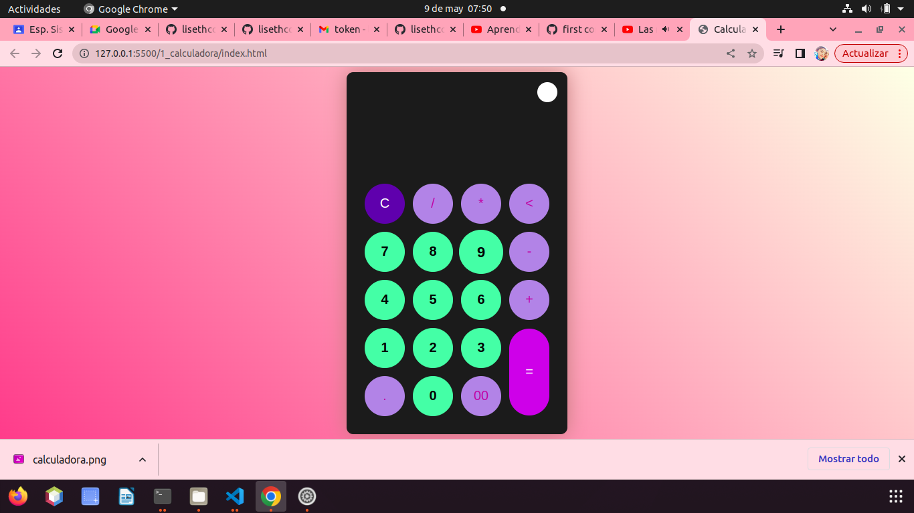
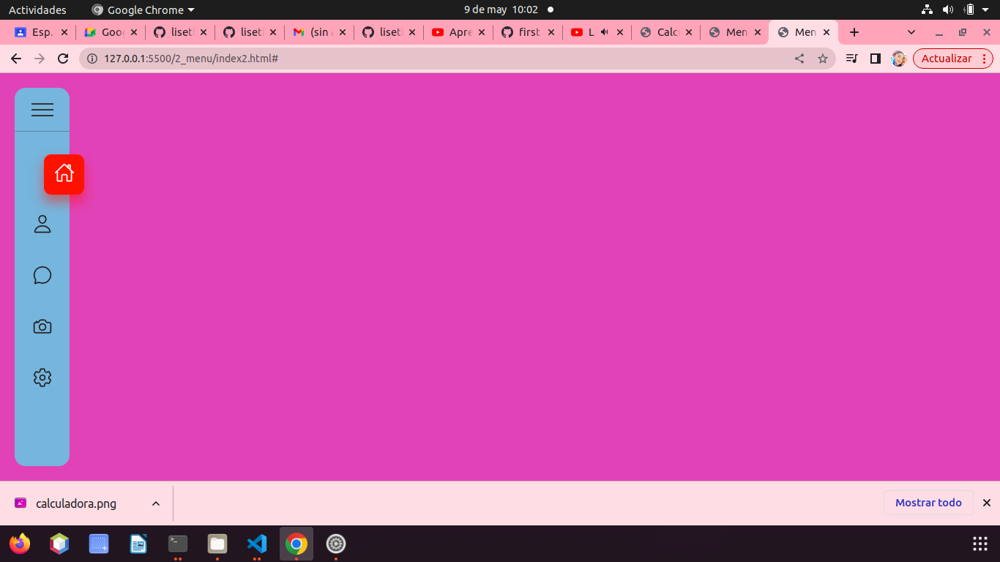
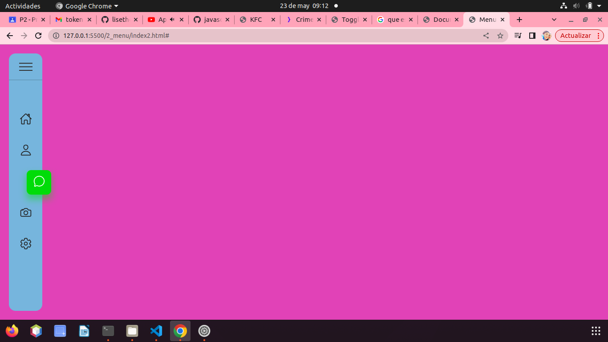
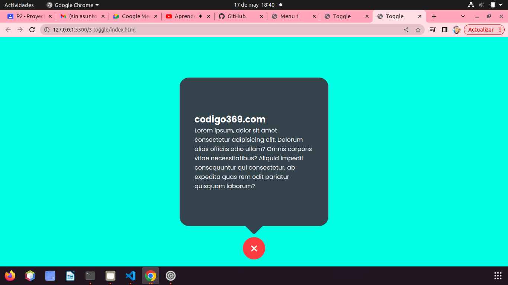
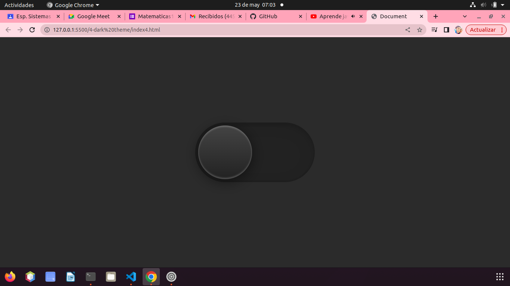
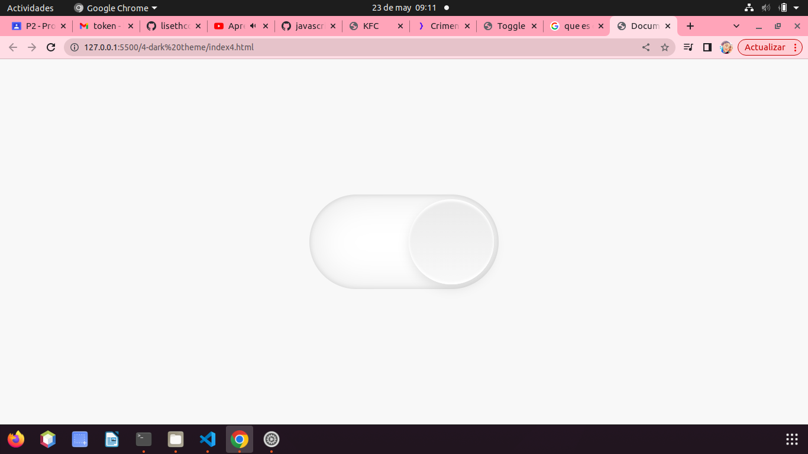
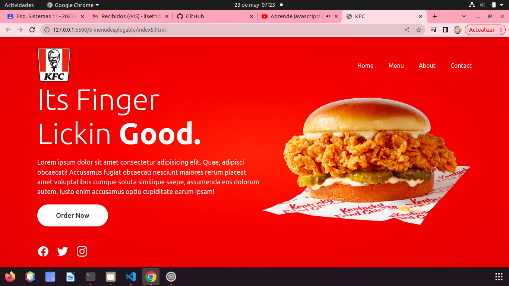

# proyecto-js
# el primer ejercicio es de una calculadora intregando js y css 

# el segundo proyecto es un menu donde le damos utilidad al css; como stylecss.map y style.scss

# el tercer proyecto toggle es como una especie de boton o palanca que al dar click nos mostrara un letrero

# el cuarto proyecto dark theme donde podemos poner modo o tema oscuro a un sitio

# el 5 proyecto "menu desplegable" es una especie de menu desplebagle con sus respectivo css 
